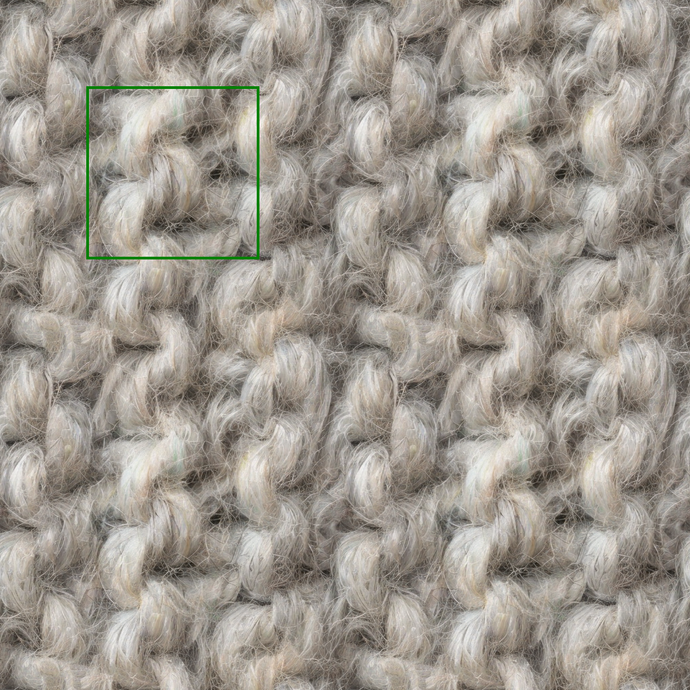
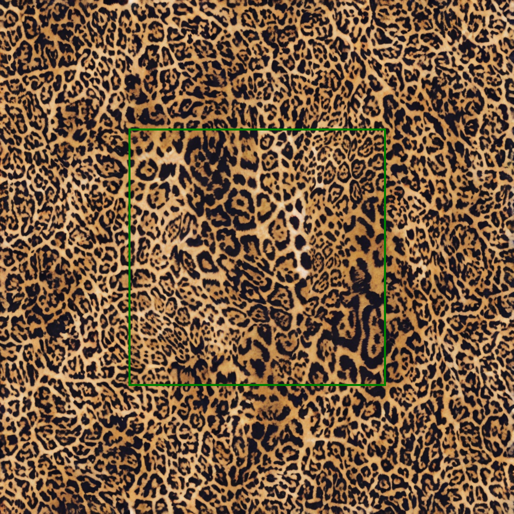

# Textile Generation based on Diffusion Models


This repository contains a toolkit for the semantic expansion and synthesis of textile textures, developed as part of a Master’s Thesis in Computer Engineering at the University of Bologna.

## Project Overview

The project tackles a key bottleneck in AAA game development: the creation of high-quality textile assets.

Traditional tiling techniques often produce visible repetitions (the *“wallpaper effect”*), while manual asset creation is both expensive and time-consuming.  
This work introduces a generative approach to perform **semantic upscaling** from **256×256** source samples to **1024×1024** production-ready textures that are:

- Seamless (natively tileable)
- Structurally coherent
- Visually consistent

## Key Features

- **Dual-Pathway Framework** 
  Adaptive generation strategies based on textile topology:
  - Regular / Geometric patterns (first figure)
  - Irregular / Organic patterns (second figure)  
<p align="center">
  
  
</p>


- **Visual Guidance (IP-Adapter)**  
  Uses image-based conditioning to control weave density and material identity, overcoming the limitations of text-only prompts.

- **Native Tileability**  
  Seamless textures are achieved through Noise Rolling and Circular Padding, applied directly within the denoising loop to model the latent space as a toroidal surface.

- **Latent Replication**  
  A structured initialization strategy applied at ~60% of the denoising process to upscale resolution while preventing structural drift.

## Technical Stack

- **Model:** Stable Diffusion v1.5 (Latent Diffusion Model)  
- **VAE Decoder:** Fine-tuned MSE (ft-mse) variant for high-frequency detail preservation  
- **Hardware:** NVIDIA Quadro P4000 (Pascal architecture)

## Project Structure
```text
.
├── assets/
├── main_irregular.ipynb  # code for texture with irregular patterns
├── main_regular.ipynb    # code for texture with regular patterns
├── docs/
│   └── textile-generation_presentation.pdf
├── README.md
├── .gitignore
├── LICENSE
```

## Authors

- **Federica Di Giaimo**  
- **Supervisor:** Prof.ssa Serena Morigi  
- **Co-supervisor:** Paolo Zuzolo
